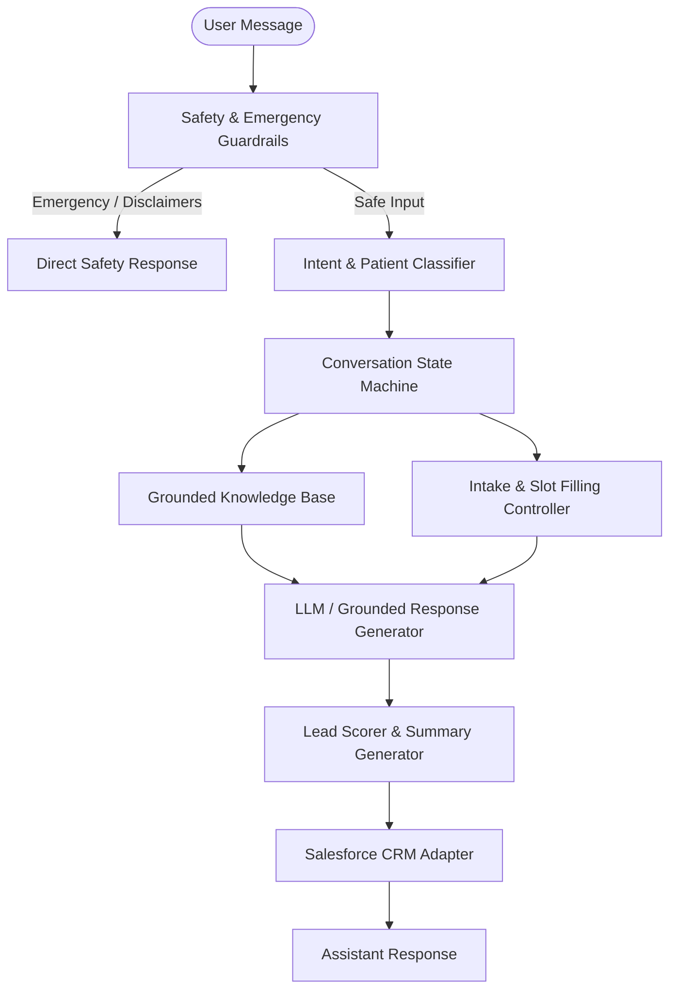

# 🏥 CareConnect Clinics — AI Patient Intake & Triage Agent

[](https://www.python.org/downloads/)
[](https://fastapi.tiangolo.com/)
[](tests/)
[](LICENSE)

An intelligent, safety-first conversational AI agent designed for **CareConnect Clinics**. The agent automates patient triage, answers clinic service inquiries with strict factual grounding, collects appointment intake details, scores inbound leads, and syncs structured records to Salesforce CRM.

---

##  Key Features

-  **Safety-First Healthcare Guardrails**:
  - **Emergency Intercept**: Automatically detects urgent/critical symptoms and escalates immediately with emergency helpline instructions.
  - **Clinical Boundaries**: Strict guardrails preventing medical diagnoses or medication prescriptions, providing compliant disclaimers and next-step offers.
  - **Human Handoff & EHR Safeguards**: Dedicated fallbacks for human escalations and electronic health record boundaries.
-  **Intent & Patient Classification**: Accurately differentiates **New** vs. **Existing Patients** and categorizes intents (`APPOINTMENT_REQUEST`, `SERVICE_INFORMATION`, `EXISTING_PATIENT_SUPPORT`, `GENERAL_INQUIRY`, `EMERGENCY`, `HUMAN_HANDOFF`).
-  **Grounded Knowledge Base (RAG)**: Factual retrieval over clinic locations, services, operating hours, doctors, pricing, and appointment policies with zero hallucination.
-  **Conversational Intake Controller**: Context-aware slot-filling to collect patient full name, contact information (phone, email), preferred clinic location, specialty service, and desired time slot.
-  **Lead Qualification & Scoring**: Calculates dynamic lead scores based on urgency, service interest, insurance status, and profile completeness, categorizing leads into **Hot**, **Warm**, or **Cold**.
-  **Salesforce CRM Integration**: Produces compliant Salesforce `Lead` and `Task` payloads with summarized clinical context, qualification tier, and priority tags.
-  **Multiple Deployment Modes**:
  - **Interactive CLI**: Terminal-based chat loop for rapid testing and triage.
  - **FastAPI Web Server & UI**: Embedded responsive chat interface and REST endpoint (`POST /chat`).
  - **Script / Scenario Replay**: Batch simulation for regression testing.
-  **Hybrid LLM Support**: Runs seamlessly with OpenAI API models or offline rule-based mock clients for local testing and CI/CD pipelines.

---

##  Architecture Overview



---

##  Project Structure

```
├── careconnect_agent/             # Core Agent Package
│   ├── __init__.py                # Package entrypoint & public exports
│   ├── agent.py                   # Master CareConnectAgent orchestrator
│   ├── classifiers.py             # Rule-based & heuristic intent classifiers
│   ├── config.py                  # Environment config & validation (Pydantic/dotenv)
│   ├── grounded.py                # Grounded Q&A prompt generator
│   ├── intake.py                  # Conversational intake & slot-filling engine
│   ├── knowledge_base.py          # Clinic locations, doctors, services, FAQs
│   ├── llm.py                     # LLM client abstractions (OpenAI & Mock)
│   ├── safety.py                  # Medical safety disclaimers & emergency regexes
│   ├── salesforce.py              # CRM payload builder & Salesforce adapter
│   ├── scoring.py                 # Lead scoring & temperature engine (Hot/Warm/Cold)
│   ├── state.py                   # Conversation state model
│   └── summary.py                 # CRM briefing & notes generator
├── test_scripts/                  # Test scenarios & conversation transcripts
│   └── full_happy_path.txt        # End-to-end appointment intake script
├── tests/                         # Comprehensive test suite (62 test cases)
│   ├── conftest.py                # Pytest fixtures and test setup
│   ├── test_scenarios.py          # Full multi-turn conversation scenario tests
│   └── test_units.py              # Unit tests for scoring, safety, classifiers, etc.
├── .env.example                   # Environment variable template
├── .gitignore                     # Git ignore rules
├── requirements.txt               # Python package dependencies
└── run.py                         # Unified entrypoint (CLI, FastAPI, and Script runner)
```

---

##  Installation & Setup

### 1. Clone the Repository
```bash
git clone https://github.com/kumarigarima09/careconnect-agent.git
cd careconnect-agent
```

### 2. Create and Activate a Virtual Environment
```bash
python3 -m venv .venv
source .venv/bin/activate   # On Windows: .venv\Scripts\activate
```

### 3. Install Dependencies
```bash
pip install -r requirements.txt
```

### 4. Configure Environment Variables (Optional)
Copy `.env.example` to `.env` and configure your settings:
```bash
cp .env.example .env
```
```env
# Optional: Set your OpenAI API Key (if omitted, offline mock mode is used)
OPENAI_API_KEY=your_openai_api_key_here
CARECONNECT_MODEL=gpt-4o-mini
```

---

##  Usage

### 1. Interactive Terminal Chat
Launch the conversational agent in interactive CLI mode:
```bash
python run.py
```

### 2. FastAPI Web Server & UI
Start the web server with the built-in modern chat web interface:
```bash
python run.py --http --port 8000
```
- Open your browser and navigate to: **`http://localhost:8000`**
- **API Endpoint**:
  ```bash
  curl -X POST http://localhost:8000/chat \
    -H "Content-Type: application/json" \
    -d '{"message": "I would like to book a dermatology appointment in Noida."}'
  ```

### 3. Automated Script Replay
Run end-to-end conversation scripts:
```bash
python run.py --script test_scripts/full_happy_path.txt
```

---

##  Testing

The repository includes a comprehensive test suite covering safety filters, classification, grounded answers, state transitions, scoring, and end-to-end dialogue trees.

Run all tests using `pytest`:
```bash
pytest
```

---

##  Lead Scoring Matrix

Inbound leads are evaluated dynamically based on criteria collected during intake:

| Criteria | Points | Description |
| :--- | :--- | :--- |
| **Contact Info Provided** | +25 pts | Full Name, Phone, and Email captured |
| **Service Specified** | +20 pts | Clinical department or treatment identified |
| **Location Confirmed** | +15 pts | Valid clinic branch selected |
| **Timeline / Date Preference**| +15 pts | Preferred time window or date indicated |
| **Insurance / Payment Type**  | +15 pts | Insurance coverage or self-pay specified |
| **Urgency / Timeliness**      | +10 pts | Immediate or next-day care needed |

- ** Hot Lead** (Score $\ge 70$): High-priority follow-up, rapid CRM Task creation.
- ** Warm Lead** (Score $40 - 69$): Standard-priority follow-up within 24 hours.
- **Cold Lead** (Score $< 40$): Low-priority general inquiry queue.

---

##  Safety & Healthcare Disclaimers

> **Disclaimer**: This AI assistant is intended for administrative scheduling, clinic inquiries, and triage assistance. It is **not** a diagnostic medical device and does not prescribe medications. In case of life-threatening emergencies, patients are immediately instructed to contact emergency services (e.g., 911 / 112 / 102) or visit the nearest emergency department.

---


